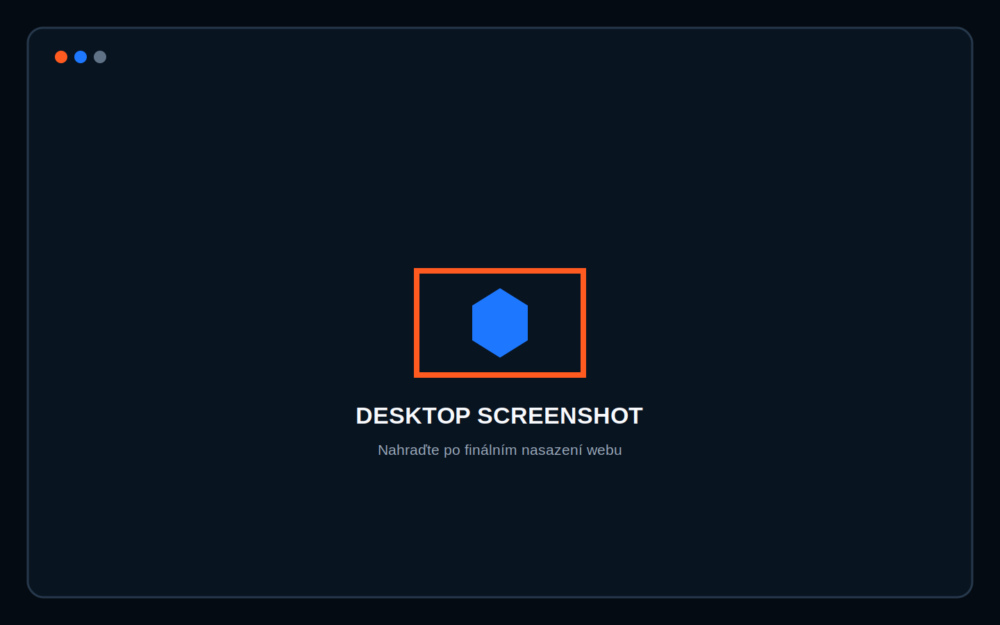
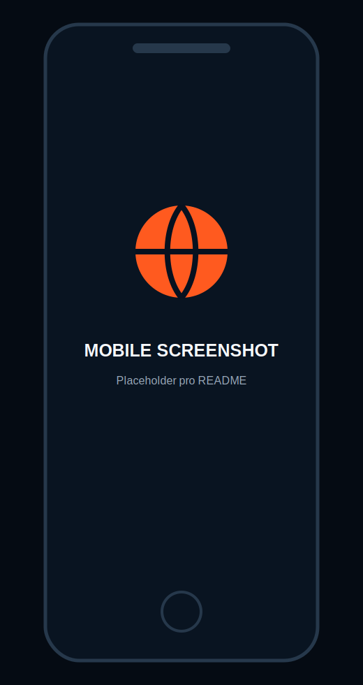

# San Antonio Spurs Fan Experience

Moderní responzivní školní fanouškovská prezentace věnovaná týmu **San Antonio Spurs**. Projekt představuje historii klubu, pět mistrovských titulů, legendární hráče, současnou éru Victora Wembanyamy, týmovou filozofii a vztah Spurs k městu San Antonio.

Web je vytvořen bez frameworků pouze pomocí HTML5, CSS3 a Vanilla JavaScriptu ES6+.

> **Živý web přes GitHub Pages:**  
> https://uzivatel.github.io/spurs-fan-experience/

## Obsah

1. [Téma a cíl projektu](#téma-a-cíl-projektu)
2. [Hlavní funkce](#hlavní-funkce)
3. [Použité technologie](#použité-technologie)
4. [Adresářová struktura](#adresářová-struktura)
5. [Nastavení webu](#nastavení-webu)
6. [Performance](#1-performance)
7. [SEO](#2-seo)
8. [Accessibility](#3-accessibility)
9. [Sociální sítě](#4-sociální-sítě)
10. [UI/UX](#5-uiux)
11. [AI integrace](#6-ai-integrace)
12. [AI deník](#ai-deník)
13. [Instalace přes Live Server](#instalace-přes-live-server)
14. [Nasazení na GitHub Pages](#nasazení-na-github-pages)
15. [Galerie](#galerie)

## Téma a cíl projektu

Cílem projektu je představit San Antonio Spurs jako sportovní organizaci s výraznou historií a kulturou. Web není výsledkovým portálem ani kopií oficiální stránky. Je to autorsky navržená školní microsite, která kombinuje fakta, vizuální vyprávění a interaktivní funkce.

Obsah stránky je uspořádán jako fanouškovská cesta:

- hero sekce se sloganem **Team first. Always.**;
- základní údaje o organizaci;
- představení klubové identity Silver & Black;
- přehled pěti titulů;
- historická časová osa;
- legendární Big Three: Tim Duncan, Tony Parker a Manu Ginóbili;
- současná kapitola s Victorem Wembanyamou;
- sekce **Why Spurs?** o klubové kultuře;
- galerie a zajímavosti;
- přístupné FAQ;
- závěrečné CTA **Explore the Spurs**.

Projekt je neoficiální, nekomerční a vytvořený pro vzdělávací účely. Nepoužívá oficiální logo ani fotografie hráčů. Stylizované siluety a hero vizuál jsou originální grafické prvky.

## Hlavní funkce

- responzivní Mobile First rozložení;
- mobilní navigace;
- panel nastavení otevřený ikonou ozubeného kola;
- plnohodnotný tmavý a světlý režim;
- přepínání češtiny a angličtiny;
- interaktivní porovnání výšky s Victorem Wembanyamou;
- uložení voleb do `localStorage`;
- FAQ accordion;
- tlačítko zpět nahoru;
- jemné animace při scrollování;
- respektování `prefers-reduced-motion`;
- sémantické HTML a ARIA atributy.

### Porovnání výšky

Interaktivní sekce používá referenční výšku Victora Wembanyamy `224 cm / 7 ft 4 in`. Uživatel může zadat svou výšku v centimetrech nebo palcích. JavaScript převede jednotky a nastaví CSS proměnnou podle vztahu:

```javascript
const ratio = userHeightCm / 224;
heightStage.style.setProperty("--user-ratio", ratio);
```

Silueta uživatele je modrá a stojí vedle transparentního PNG Victora. Obě postavy používají stejnou základní čáru. Referenční výška fotografie se měří podle neprůhledné oblasti od vrcholu vlasů po spodní hranu bot, takže transparentní bezpečnostní okraj nezkresluje měřítko.

Uživatelská postava je vytvořena jako inline SVG s přirozenějšími sportovními proporcemi: čelistí, krkem, rameny, pasem, tvarovanými pažemi a oddělenými nohami. Celé SVG se škáluje jako jeden celek, takže se nedeformují jeho dílčí části.

Vodorovná přerušovaná čára ukazuje úroveň temene uživatele vůči Victorovi. Její poloha využívá stejnou CSS proměnnou jako výška SVG:

```css
.user-height-guide {
  bottom: calc(2.5rem + 32rem * var(--user-ratio));
}
```

JavaScript po každé změně vstupu aktualizuje `--user-ratio`, a tím současně posune postavu, její popisek i výškovou čáru. Barva čáry se mění pomocí proměnné podle světlého nebo tmavého režimu.

> **Licenční upozornění:** fotografie slouží pouze pro školní nekomerční projekt. Před veřejným publikováním je nutné ověřit licenci původní fotografie a oprávnění k jejímu užití.

## Použité technologie

- **HTML5** – sémantická struktura, metadata, JSON-LD.
- **CSS3** – vlastní design systém, CSS proměnné, Grid, Flexbox a media queries.
- **Vanilla JavaScript ES6+** – překlady, režimy vzhledu a interakce.
- **WebP** – optimalizovaný hero a sdílecí vizuál.
- **SVG** – lokální favicon.
- **IDE:** Visual Studio Code.

Projekt nepoužívá React, Vue, Angular, Bootstrap, Tailwind, jQuery ani jiný framework.

## Adresářová struktura

```text
spurs-fan-experience/
├── index.html
├── style.css
├── main.js
├── README.md
├── robots.txt
├── sitemap.xml
├── favicon.svg
├── desktop-placeholder.svg
├── mobile-placeholder.svg
├── spurs-hero.webp
├── tim-duncan.png
├── tony-parker.png
├── manu-ginobili.png
├── victor-future.png
└── wembanyama-transparent.png
```

## Nastavení webu

Panel nastavení se otevře ikonou ozubeného kola v pravém horním rohu. Je implementován jako prvek `aside` a jeho viditelnost je propojena s ovládacím tlačítkem pomocí `aria-controls` a `aria-expanded`.

### Světlý a tmavý režim

Barvy jsou definovány pomocí CSS proměnných. Světlý režim mění pozadí, text, karty, okraje, panel nastavení i navigaci, takže nejde pouze o invertování barev.

```css
:root {
  --bg: #090a0c;
  --surface: #111318;
  --text: #f7f7f5;
  --muted: #a7abb2;
}

[data-theme="light"] {
  --bg: #f3f3f1;
  --surface: #ffffff;
  --text: #111216;
  --muted: #565b62;
}
```

JavaScript mění atribut na kořenovém elementu a ukládá volbu:

```javascript
const setTheme = (theme) => {
  document.documentElement.dataset.theme = theme;
  localStorage.setItem("spurs-theme", theme);
};
```

Přepínač má roli `switch` a stav `aria-checked`, takže jej správně interpretuje čtečka obrazovky.

### Přepínání češtiny a angličtiny

Všechny hlavní texty, nadpisy, tlačítka, navigace, popisky a FAQ mají překlady uložené v objektu `translations` v `main.js`.

```javascript
const translations = {
  cs: {
    navHistory: "Historie",
    faq1Q: "Kolik titulů Spurs vyhráli?"
  },
  en: {
    navHistory: "History",
    faq1Q: "How many titles have the Spurs won?"
  }
};
```

HTML prvky odkazují na překladový klíč:

```html
<h2>
  <span data-i18n="faqTitleA">Často kladené</span>
  <em data-i18n="faqTitleB">otázky</em>
</h2>
```

Funkce `applyLanguage()` mění texty, `lang` dokumentu, alternativní texty, ARIA popisky a stav jazykových tlačítek. Volba se ukládá do `localStorage`.

---

## 1. Performance

### Teoretický popis

Výkon webu ovlivňuje rychlost zobrazení, spotřebu dat, stabilitu layoutu a výsledky metrik Core Web Vitals. Statický web má výhodu, že nepotřebuje frameworkový runtime ani náročný build.

### Konkrétní řešení

Hero obraz je přednačten:

```html
<link rel="preload"
      href="spurs-hero.webp"
      as="image"
      type="image/webp">
```

Obraz v galerii využívá lazy loading a pevné rozměry:

```html

```

JavaScript neblokuje parsování HTML:

```html
<script src="main.js" defer></script>
```

### Proč je to použité

- WebP snižuje velikost hlavního rastrového souboru.
- `width` a `height` rezervují místo a omezují CLS.
- Lazy loading odkládá obraz mimo první viewport.
- `defer` spustí kód až po zpracování HTML.
- Projekt má jeden CSS, jeden JS a jeden hlavní rastrový obraz.
- Stylizované hráčské vizuály jsou vytvořené v CSS bez dalších HTTP požadavků.
- Nejsou použity externí fonty, ikony ani analytické skripty.
- Animace používají převážně `opacity` a `transform`.

### Minifikace

Zdrojové soubory zůstávají čitelné pro školní kontrolu. Před produkčním nasazením lze vytvořit minifikované varianty:

```bash
npx terser main.js -c -m -o main.min.js
npx clean-css-cli -o style.min.css style.css
```

Následně je nutné změnit odkazy v `index.html`. Čitelné zdroje je vhodné ponechat v repozitáři pro obhajobu.

---

## 2. SEO

### Teoretický popis

Technické SEO umožňuje vyhledávači pochopit téma, jazyk, strukturu a preferovanou adresu stránky. Důležité jsou metadata, nadpisová hierarchie, sémantické značky, strukturovaná data a soubory pro indexaci.

### Konkrétní řešení

```html
<title>San Antonio Spurs Fan Experience</title>
<meta name="description"
      content="Moderní fanouškovská prezentace San Antonio Spurs: historie, pět titulů, klubové legendy, současná éra a kultura týmu.">
<link rel="canonical"
      href="https://uzivatel.github.io/spurs-fan-experience/">
```

JSON-LD:

```html
<script type="application/ld+json">
{
  "@context": "https://schema.org",
  "@type": "WebSite",
  "name": "San Antonio Spurs Fan Experience",
  "inLanguage": ["cs-CZ", "en-US"],
  "about": {
    "@type": "SportsTeam",
    "name": "San Antonio Spurs",
    "sport": "Basketball"
  }
}
</script>
```

### Proč je to použité

- Jedno `h1` přesně pojmenovává hlavní téma.
- Nadpisy `h2` a `h3` vytvářejí logickou hierarchii.
- `header`, `nav`, `main`, `section`, `article`, `aside` a `footer` popisují význam oblastí.
- Kanonická URL omezuje duplicity.
- `robots.txt` dovoluje indexaci a odkazuje na sitemap.
- `sitemap.xml` obsahuje preferovanou adresu.
- JSON-LD popisuje web a jeho vztah ke sportovnímu týmu.

Po nasazení je nutné nahradit uživatele v placeholder URL v `index.html`, `robots.txt`, `sitemap.xml` a README.

---

## 3. Accessibility

### Teoretický popis

Přístupný web lze používat klávesnicí, čtečkou obrazovky, při zvětšení i s omezenými animacemi. Význam ovládacích prvků nesmí být závislý pouze na vzhledu.

### Konkrétní řešení

Skip link:

```html
<a class="skip-link" href="#main-content">
  Přeskočit na hlavní obsah
</a>
```

Přístupný panel nastavení:

```html
<button aria-expanded="false"
        aria-controls="settings-panel"
        aria-label="Otevřít nastavení">
</button>

<aside id="settings-panel"
       aria-labelledby="settings-title"
       hidden>
</aside>
```

Viditelný focus:

```css
:focus-visible {
  outline: 3px solid #54b4ff;
  outline-offset: 4px;
}
```

Omezení pohybu:

```css
@media (prefers-reduced-motion: reduce) {
  *, *::before, *::after {
    scroll-behavior: auto !important;
    transition-duration: .01ms !important;
  }
}
```

### Proč je to použité

- Fotografie má smysluplný `alt`, dekorativní prvky používají `aria-hidden`.
- Mobilní menu i nastavení oznamují otevřený stav pomocí `aria-expanded`.
- Nastavení lze zavřít křížkem, kliknutím mimo panel i klávesou Escape.
- Po otevření panelu se fokus přesune na tlačítko zavření.
- Přepínač režimu používá `role="switch"` a `aria-checked`.
- Jazyková tlačítka používají `aria-pressed`.
- FAQ propojuje otázku a odpověď přes `aria-controls` a `aria-labelledby`.
- Kontrast byl navržen pro tmavé i světlé barevné schéma.
- Web podporuje ovládání klávesnicí a respektuje omezený pohyb.

---

## 4. Sociální sítě

### Teoretický popis

Open Graph metadata řídí náhled na Facebooku a LinkedIn. Twitter/X Card metadata určují podobu sdíleného odkazu na síti X.

### Konkrétní řešení

```html
<meta property="og:title"
      content="San Antonio Spurs Fan Experience">
<meta property="og:description"
      content="Poznej historii, legendy a kulturu jednoho z nejúspěšnějších klubů moderní NBA.">
<meta property="og:image"
      content="https://uzivatel.github.io/spurs-fan-experience/spurs-hero.webp">

<meta name="twitter:card" content="summary_large_image">
<meta name="twitter:image"
      content="https://uzivatel.github.io/spurs-fan-experience/spurs-hero.webp">
```

### Proč je to použité

- Velká obrazová karta je pro sportovní obsah vizuálně atraktivní.
- Titulek a popis fungují i bez kontextu webu.
- Sdílecí obraz má široký poměr a bezpečný prostor pro ořez.
- Obraz neobsahuje oficiální logo ani podobu skutečného hráče.
- `og:image:alt` poskytuje textovou alternativu.

Hero WebP v projektu slouží jako funkční placeholder. Při finálním nasazení lze vytvořit samostatný obraz o rozměru přibližně 1200 × 630 px.

---

## 5. UI/UX

### Teoretický popis

UI je vizuální rozhraní a UX je způsob, jakým uživatel rozumí obsahu a pohybuje se mezi funkcemi. Mobile First začíná jednoduchým jednosloupcovým layoutem a rozšiřuje jej podle dostupné šířky.

### Konkrétní řešení

```css
.culture-grid {
  display: grid;
  gap: 1rem;
}

@media (min-width: 900px) {
  .culture-grid {
    grid-template-columns: repeat(4, 1fr);
  }
}
```

Plynulé nadpisy:

```css
h2 {
  font-size: clamp(2.6rem, 11vw, 5.6rem);
}
```

### Proč je to použité

- Paleta černé, bílé, šedé a stříbrné odpovídá identitě Spurs.
- Navigace vede na tým, historii, legendy, kulturu a FAQ.
- CTA se opakuje v hero a závěru.
- Velké nadpisy a čísla vytvářejí sportovní hierarchii.
- Karty mají konzistentní okraje a geometrické tvary.
- Panel nastavení je dostupný na mobilu i desktopu.
- Světlý režim je samostatně navržený, nikoliv pouze invertovaný.
- Scroll animace podporují rytmus stránky, ale nejsou nutné k pochopení obsahu.

---

## 6. AI integrace

### Teoretický popis

AI lze použít jako pomocníka při návrhu struktury, variant textů, interakcí a kontrolních seznamů. Výstupy vyžadují lidskou kontrolu, ověření faktů a úpravu podle konkrétního zadání.

### Konkrétní použití

AI byla použita pro:

- návrh struktury webu o San Antonio Spurs;
- návrh českých a anglických textů;
- návrh objektu s překlady a přepínače jazyka;
- návrh CSS proměnných pro světlý a tmavý režim;
- návrh přístupného panelu nastavení;
- kontrolu Performance, SEO, Accessibility, sociálních sítí a UI/UX;
- návrh originální černostříbrné hero grafiky bez log a skutečných hráčů;
- kontrolu konzistence README a zdrojových souborů.

### Proč je to použité

AI urychlila ideaci a pomohla vytvořit dvě jazykové varianty. Fakta, kód a přístupnost ale musí vždy projít lidskou kontrolou. Projekt transparentně uvádí, že jde o neoficiální fanouškovskou školní prezentaci.

## AI deník

### Prompt 1 – struktura prezentace

```text
Navrhni informační architekturu moderní jednostránkové školní microsite
o San Antonio Spurs. Zahrň identitu týmu, pět titulů, historii,
Big Three, Victora Wembanyamu, Why Spurs, galerii, zajímavosti, FAQ a CTA.
```

**Použití výstupu:** sekce byly seřazeny od emoce a identity přes historii a hráče ke klubové kultuře.

### Prompt 2 – vizuální směr

```text
Navrhni čistý sportovní design inspirovaný San Antonio Spurs.
Použij černou, bílou, šedou a stříbrnou, velkou kondenzovanou typografii,
jemné linie palubovky a profesionální redakční atmosféru.
```

**Použití výstupu:** vznikl vlastní systém CSS proměnných, karet, nadpisů a geometrických ilustrací.

### Prompt 3 – jazykový přepínač

```text
Navrhni Vanilla JavaScript řešení pro přepínání češtiny a angličtiny.
Překlady ulož do objektu, HTML propojuj přes data atributy,
měň také alt texty a ARIA labely a volbu ukládej do localStorage.
```

**Použití výstupu:** `translations`, `data-i18n`, `data-label-key`, `data-alt-key` a funkce `applyLanguage()`.

### Prompt 4 – barevný režim

```text
Navrhni přístupný dark/light mode bez frameworku.
Použij CSS proměnné, data-theme na html, role switch,
aria-checked a uložení volby do localStorage.
```

**Použití výstupu:** tmavé a světlé barevné schéma a funkce `setTheme()`.

### Prompt 5 – optimalizační kontrola

```text
Zkontroluj statický fanouškovský web podle oblastí Performance, SEO,
Accessibility, social sharing a Mobile First UI/UX.
Navrhni konkrétní opravy bez externích knihoven.
```

**Použití výstupu:** preload, lazy loading, `defer`, JSON-LD, ARIA vazby, reduced motion, focus styly a responzivní breakpointy.

### Prompt 6 – hero grafika

```text
Vytvoř širokou filmovou basketbalovou arénu v černé a stříbrné.
Míč umísti napravo a vlevo ponech tmavý prostor pro nadpis.
Bez oficiálního loga Spurs, bez textu, značek a podoby skutečného hráče.
```

**Použití výstupu:** obraz byl optimalizován do WebP a použit v hero, galerii a CTA.

## Instalace přes Live Server

Projekt nemá závislosti ani build proces.

1. Otevřete složku projektu ve Visual Studio Code.
2. Nainstalujte rozšíření **Live Server** od Ritwick Dey.
3. Klikněte pravým tlačítkem na `index.html`.
4. Vyberte **Open with Live Server**.
5. Web se otevře obvykle na `http://127.0.0.1:5500/`.

Po změně režimu nebo jazyka obnovte stránku a ověřte, že volba zůstala zachována.

## Nasazení na GitHub Pages

1. Vytvořte repozitář, například `spurs-fan-experience`.
2. Nahrajte do něj celý obsah projektu.
3. Na GitHubu otevřete **Settings → Pages**.
4. Zvolte **Deploy from a branch**.
5. Vyberte větev `main` a složku `/ (root)`.
6. Nahraďte všechny placeholder URL skutečnou adresou.

### Relativní cesty

Web používá relativní cesty bez počátečního lomítka:

```html
<link rel="stylesheet" href="style.css">
<script src="main.js" defer></script>

```

Tag `<base href="./">` zajišťuje, že se CSS, JavaScript, favicony a obrázky načítají relativně k podadresáři repozitáře. Soubor `.nojekyll` označuje projekt jako čistý statický web.

Všechny soubory projektu jsou přímo v kořeni publikované větve. Web proto funguje i při ručním nahrání souborů bez složkové struktury.

## Kontrola před odevzdáním

- ověřit HTML pomocí W3C Validatoru;
- spustit Lighthouse;
- otestovat šířky 360 px, 768 px a 1440 px;
- projít web klávesnicí;
- vyzkoušet CZ i EN;
- vyzkoušet dark i light režim;
- ověřit zachování nastavení po obnovení;
- doplnit finální URL GitHub Pages.

## Galerie

### Desktop



> Po finálním nasazení lze placeholder nahradit screenshotem `desktop.png`.

### Mobil



> Po finálním nasazení lze placeholder nahradit screenshotem `mobile.png`.

## Zdroje a upozornění

Historické milníky vycházejí z obecně známé historie klubu a oficiálních materiálů NBA. Obsah neobsahuje živé výsledky ani aktuální statistiky, takže nevyžaduje sportovní API.

San Antonio Spurs, NBA a jména hráčů náleží příslušným vlastníkům. Projekt není oficiálně spojen s NBA ani San Antonio Spurs. Slouží výhradně jako nekomerční školní prezentace.
